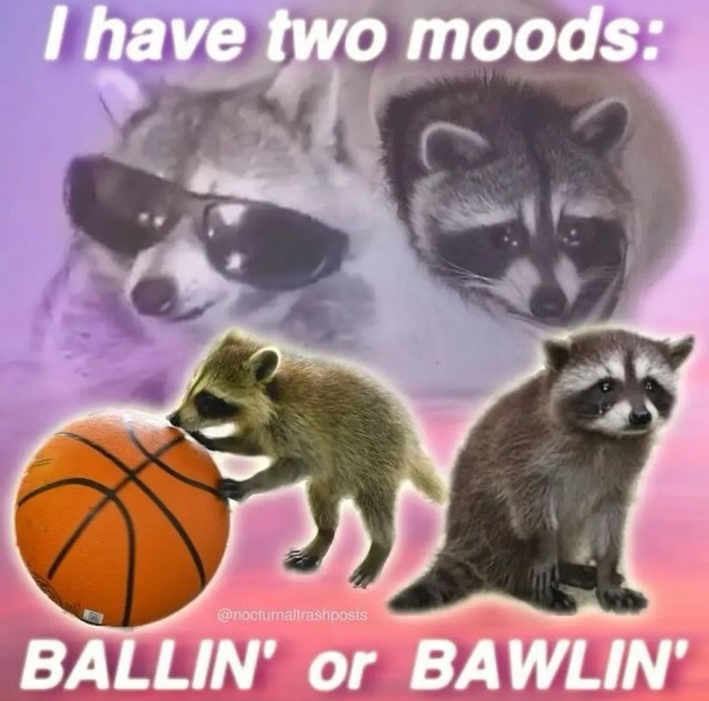

# My First Coding Assignment

## About Me
Hello! I'm Lacey. I'm an artist, bartender and marketing manager for a local Distillery on the island of Oahu! I was laid off from big tech last year and struggling to find any new jobs for a while before choosing to continue my education at the age of 30. Life looks a little different than how I expected it to look at this age but I'm happier than ever and excited to be here!
## Past Coding Experience
Absolutely none. Maybe one small code that my supervisor told me to run in Terminal at work, but I did not retain any of that information unforunately. 
## Career Goals
I would love to be able to be a full stack developer. As an Artist and creative, I'm more keen on learning front end development but I understand how pivotal back end dev is as well. It's my goal to support small businesses in this way much like I am currently in my job. I value supporting local and small businesses and want to learn how to take something as complex as web dev and be able to share it with others to boost their business and livelihoods.